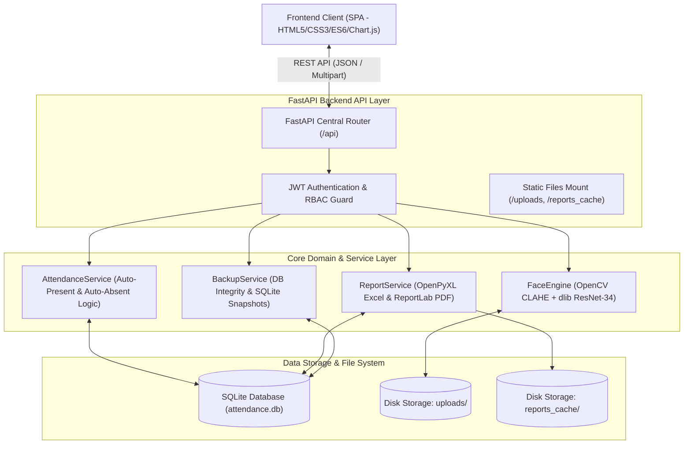
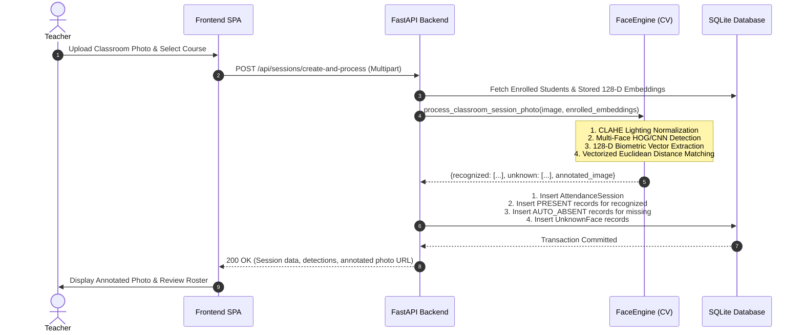

# System Architecture & Technical Specification

---

## 1. High-Level System Architecture

---

## 2. Computer Vision Recognition Pipeline

---

## 3. Data Flow & Security Model

- **Authentication**: JWT tokens signed with HS256 algorithm and 24-hour expiration. Passwords hashed using bcrypt with salt rounds.
- **Role-Based Access Control (RBAC)**:
  - `admin`: Complete administrative privileges, system diagnostics, full DB backup, student/course master edits.
  - `teacher`: Course-level attendance capture, review, overrides, unknown face resolution, and report export.
- **Biometric Privacy**: Raw biometric facial embeddings are stored as 128-dimensional mathematical floating-point vectors, ensuring irreversible one-way template storage compliant with biometric privacy standards.
