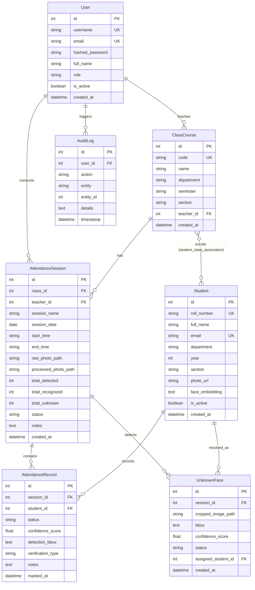

# Database Architecture & Entity Relationship Diagram (ERD)

---

## 1. Entity Relationship (ER) Diagram

---

## 2. Table Specifications & Indexes

| Table Name | Primary Key | Foreign Keys | Unique Constraints | Indexed Columns |
| :--- | :--- | :--- | :--- | :--- |
| `users` | `id` | None | `username`, `email` | `username`, `email` |
| `classes` | `id` | `teacher_id -> users.id` | `code` | `code`, `teacher_id` |
| `students` | `id` | None | `roll_number`, `email` | `roll_number`, `email` |
| `student_class_association`| `(student_id, class_id)`| `students.id`, `classes.id`| None | Composite PK |
| `attendance_sessions` | `id` | `class_id -> classes.id` | None | `class_id`, `session_date`|
| `attendance_records` | `id` | `session_id`, `student_id` | None | `session_id`, `student_id`|
| `unknown_faces` | `id` | `session_id`, `assigned_student_id`| None | `session_id`, `status` |
| `audit_logs` | `id` | `user_id` | None | `timestamp`, `action` |
